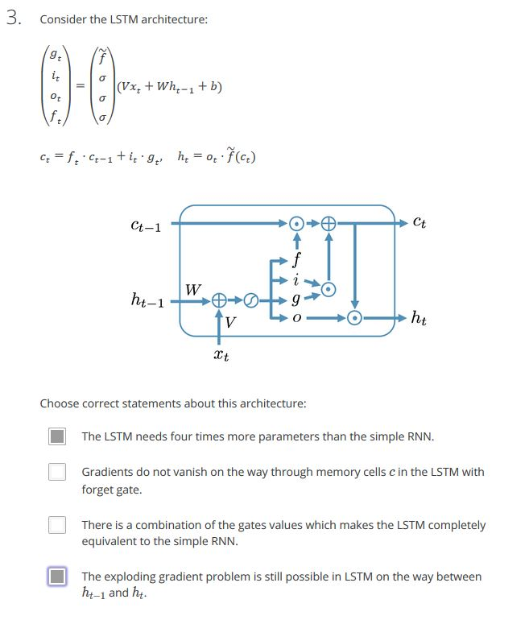
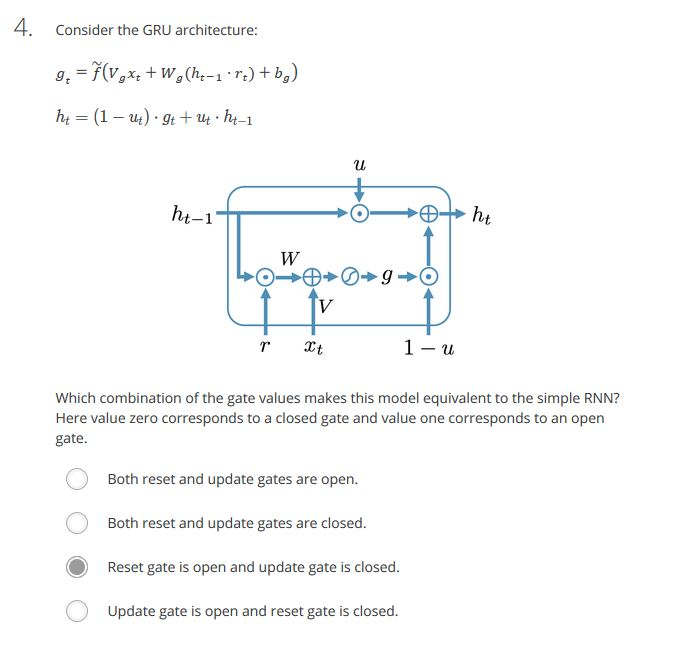

#### 1. Choose correct statements about the exploding gradient problem:
##### Ans: 
- Exploding gradient problem is easy to detect.
- The reason of the exploding gradient problem in the simple RNN is the recurrent weight matrix WWW. Nonlinearities sigmoid, tanh, and ReLU does not cause the problem.
#### 2. Choose correct statements about the vanishing gradient problem:
##### Ans: 
- Both nonlinearity and the recurrent weight matrix WWW cause the vanishing gradient problem.
- Orthogonal initialization of the recurrent weight matrix helps with the vanishing gradient problem.
#### 3. 
#### 4. 

