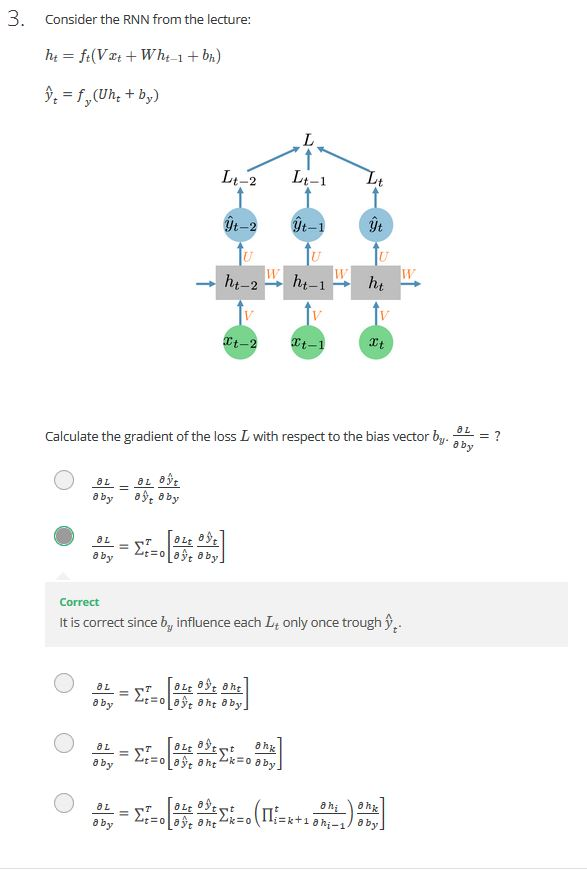
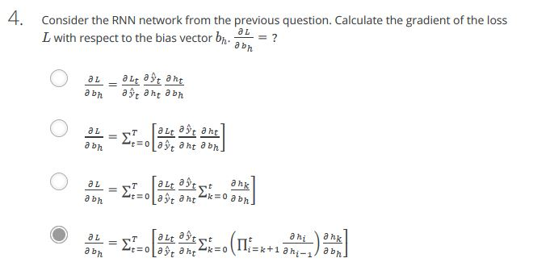

#### 1. Consider a task with input sequences of fixed length. Could RNN architecture still be useful for such task?
##### Ans: Yes
#### 2. Consider an RNN for a language generation task. y^t is an output of this RNN at each time step, LLL is a length of the input sequence, N is a number of words in the vocabulary. Choose correct statements about y^t:
##### Ans: 
- y^t is a vector of length NNN. 
- Each element of y^t is a number from 0 to 1.
#### 3. 
##### Ans: 
#### 4. 
##### Ans: 